# Understanding the Role of Fairness in User Adoption of Two-Sided Recommender Systems

A research project for CS-498 (Research Project in Computer Science II) at EPFL, supervised by Pearl Pu from the Human Computer Interaction Lab. This study investigates whether perceived fairness influences user adoption of TikTok, using Structural Equation Modeling (SEM).

## Research Question

Two-sided recommender systems (2SRS) like TikTok serve both content creators and consumers. This study asks: **Does users' perception of fairness affect their attitudes and intentions to use the platform?**

## The FAIR Model

We extended the Technology Acceptance Model (TAM) by adding **Perceived Fairness** as a construct, creating the "FAIR model":

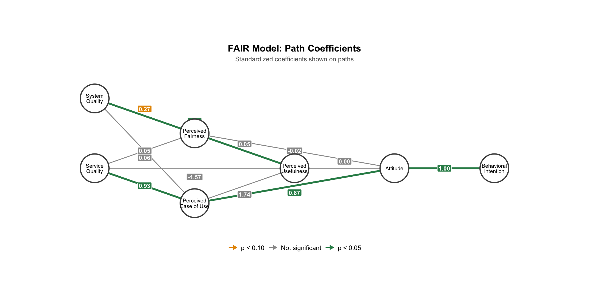

### Constructs

| Construct | Questions | Description |
|-----------|-----------|-------------|
| System Quality | Q0-Q5 | Navigation, design, response time, security |
| Service Quality | Q6-Q15 | Recommendation accuracy, novelty, adaptability |
| Perceived Fairness | Q16-Q23 | Whether recommendations are limited by demographics |
| Perceived Ease of Use | Q24-Q28 | Usability of the platform |
| Perceived Usefulness | Q29-Q35 | Entertainment value, curiosity stimulation |
| Attitude Toward Use | Q36-Q39 | Overall attitude toward using TikTok |
| Behavioral Intention | Q40-Q44 | Intention to continue using TikTok |

## Method

- **Platform**: TikTok
- **Survey**: 45 Likert-scale questions (1-5)
- **Participants**: 429 MTurk workers (filtered from 630 using reverse-worded attention checks)
- **Demographics**: Mostly ages 25-44, 50/50 gender split, 6+ months TikTok experience

## Key Findings

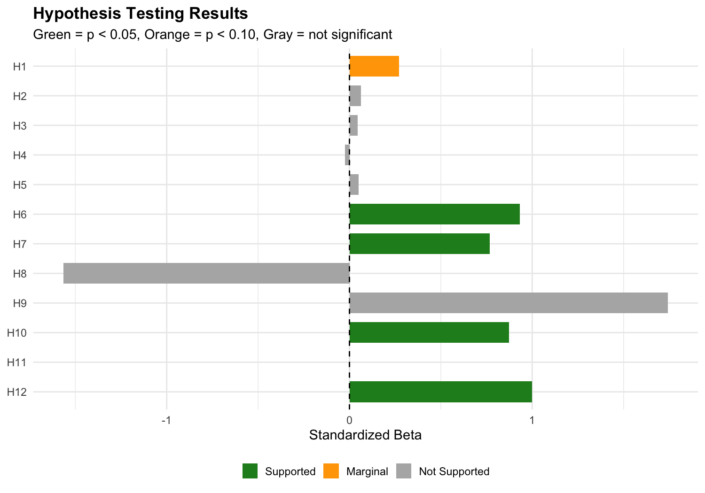

### Supported Hypotheses (p < 0.05)

| Path | $\beta$ | p-value |
|------|---------|---------|
| Service Quality -> Perceived Ease of Use | 0.931 | < 0.001 |
| System Quality -> Perceived Usefulness | 0.767 | 0.018 |
| Perceived Ease of Use -> Attitude Toward Use | 0.873 | < 0.001 |
| Attitude Toward Use -> Behavioral Intention | 1.000 | < 0.001 |

### Marginal Support (p < 0.10)

| Path | $\beta$ | p-value |
|------|---------|---------|
| System Quality -> Perceived Fairness | 0.272 | 0.059 |

### Not Supported

The core fairness hypotheses were not supported:
- Service Quality -> Perceived Fairness ($\beta$ = 0.062, p = 0.686)
- Perceived Fairness -> Perceived Usefulness ($\beta$ = 0.046, p = 0.321)
- Perceived Fairness -> Attitude Toward Use ($\beta$ = -0.024, p = 0.584)

### Model Fit

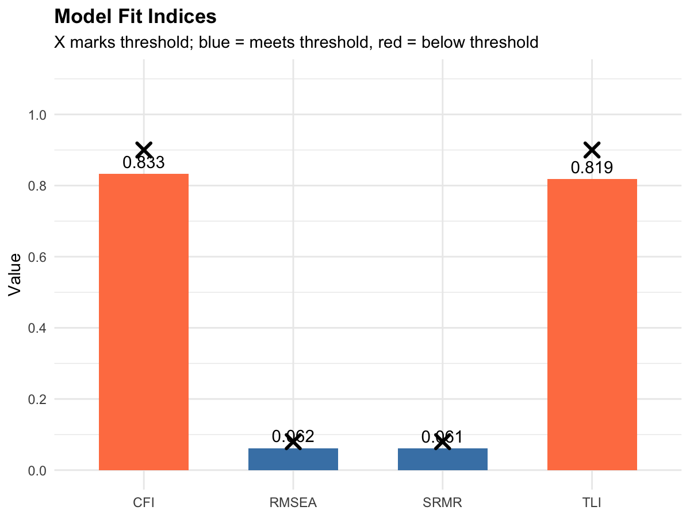

| Index | Value | Threshold | Status |
|-------|-------|-----------|--------|
| CFI | 0.833 | >= 0.90 | Below |
| TLI | 0.819 | >= 0.90 | Below |
| RMSEA | 0.062 | <= 0.08 | Good |
| SRMR | 0.061 | <= 0.08 | Good |

The below-threshold CFI/TLI values suggest the model structure may need refinement, though RMSEA and SRMR are acceptable.

## Correlation Matrices

### Inter-Construct Correlations

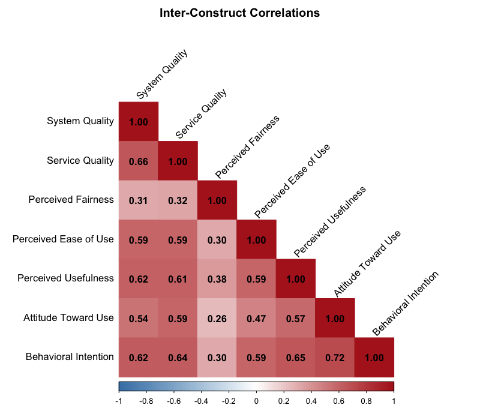

### Item Correlations by Construct

| System Quality | Service Quality |
|:--------------:|:---------------:|
| 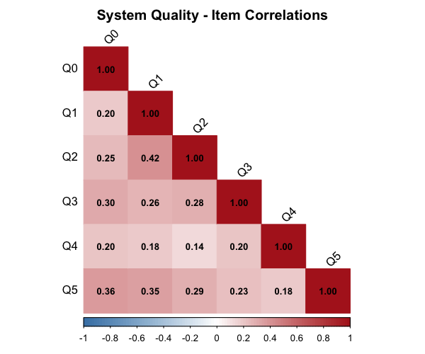 | 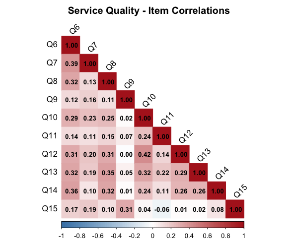 |

| Perceived Fairness | Perceived Ease of Use |
|:------------------:|:---------------------:|
| 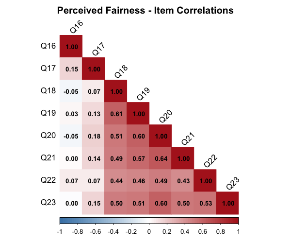 | 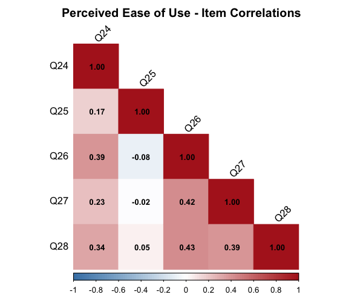 |

| Perceived Usefulness | Attitude Toward Use |
|:--------------------:|:-------------------:|
| 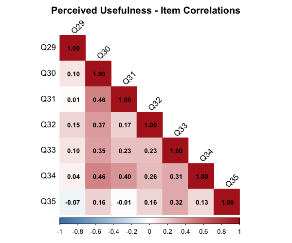 | 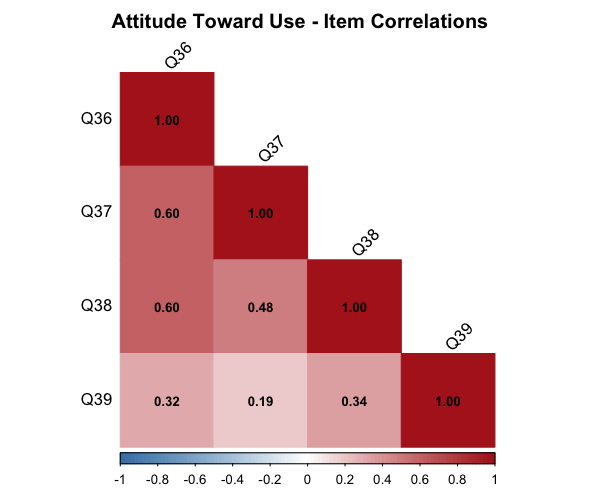 |

| Behavioral Intention |
|:--------------------:|
| 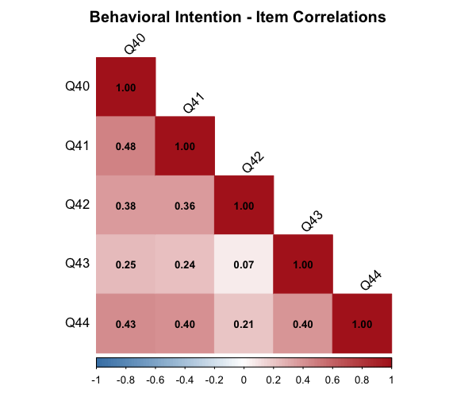 |

## Repository Structure

```
data/
  Dec2BonusDataset.csv    Survey responses (429 filtered participants)
  survey_questions.md     What each Q0-Q44 question asks

analysis/
  01_reliability.Rmd      Step 1: Internal reliability analysis
  02_cfa.Rmd              Step 2: Confirmatory Factor Analysis
  03_sem.Rmd              Step 3: Structural Equation Modeling
  METHODOLOGY.md          Detailed explanation of the analysis approach

figures/
  fair_model.png               FAIR model diagram with path coefficients
  path_coefficients.png        Bar chart of all path coefficients with 95% CIs
  hypothesis_results.png       Hypothesis testing summary
  model_fit.png                Model fit indices comparison
  construct_correlations.png   Inter-construct correlation matrix
  *_correlation.png            Item correlation matrices for each construct

renv.lock                 R package lockfile (for reproducibility)
```

## Analysis

The analysis is split into three sequential R Markdown files in `analysis/`:

1. **`01_reliability.Rmd`**: Internal reliability analysis using Cronbach's alpha. Identifies and removes items with item-total correlation < 0.3.

2. **`02_cfa.Rmd`**: Confirmatory Factor Analysis to validate the measurement model. Removes items with factor loadings < 0.4 and checks discriminant/convergent validity.

3. **`03_sem.Rmd`**: Structural Equation Modeling to test the hypothesized paths in the FAIR model and a modified version with combined constructs.

## R Environment Setup

This project uses [renv](https://rstudio.github.io/renv/) for reproducible R package management.

### First-time setup

```bash
# Install renv (if not already installed)
Rscript -e "install.packages('renv')"

# Restore the project library from the lockfile
Rscript -e "renv::restore()"
```

### Running the analysis

The analyses must be run in order since each depends on the previous:

```bash
Rscript -e "renv::activate(); setwd('analysis'); rmarkdown::render('01_reliability.Rmd')"
Rscript -e "renv::activate(); setwd('analysis'); rmarkdown::render('02_cfa.Rmd')"
Rscript -e "renv::activate(); setwd('analysis'); rmarkdown::render('03_sem.Rmd')"
```

This generates HTML notebook outputs (`.nb.html` files) in the `analysis/` directory.

### Key R packages

| Package | Purpose |
|---------|---------|
| lavaan | Structural Equation Modeling |
| semTools | SEM diagnostics (composite reliability, etc.) |
| semPlot | SEM visualization |
| ltm | Cronbach's alpha calculation |
| dplyr | Data manipulation |
| ggplot2 | Visualization |
| kableExtra | HTML tables |
| corrplot | Correlation matrix visualization |

