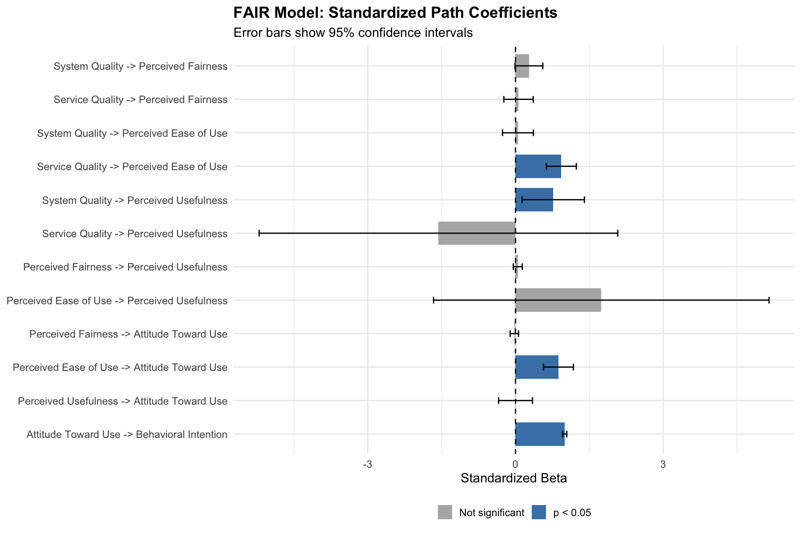

# Analysis Results

Detailed results from the SEM analysis. For methodology, see [METHODOLOGY.md](METHODOLOGY.md).

## Correlation Matrices

### Inter-Construct Correlations

### Item Correlations by Construct

| System Quality | Service Quality |
|:--------------:|:---------------:|
|  |  |

| Perceived Fairness | Perceived Ease of Use |
|:------------------:|:---------------------:|
|  |  |

| Perceived Usefulness | Attitude Toward Use |
|:--------------------:|:-------------------:|
|  |  |

| Behavioral Intention |
|:--------------------:|
|  |

## Path Coefficients

## Model Fit

| Index | Value | Threshold | Status |
|-------|-------|-----------|--------|
| CFI | 0.833 | >= 0.90 | Below |
| TLI | 0.819 | >= 0.90 | Below |
| RMSEA | 0.062 | <= 0.08 | Good |
| SRMR | 0.061 | <= 0.08 | Good |
